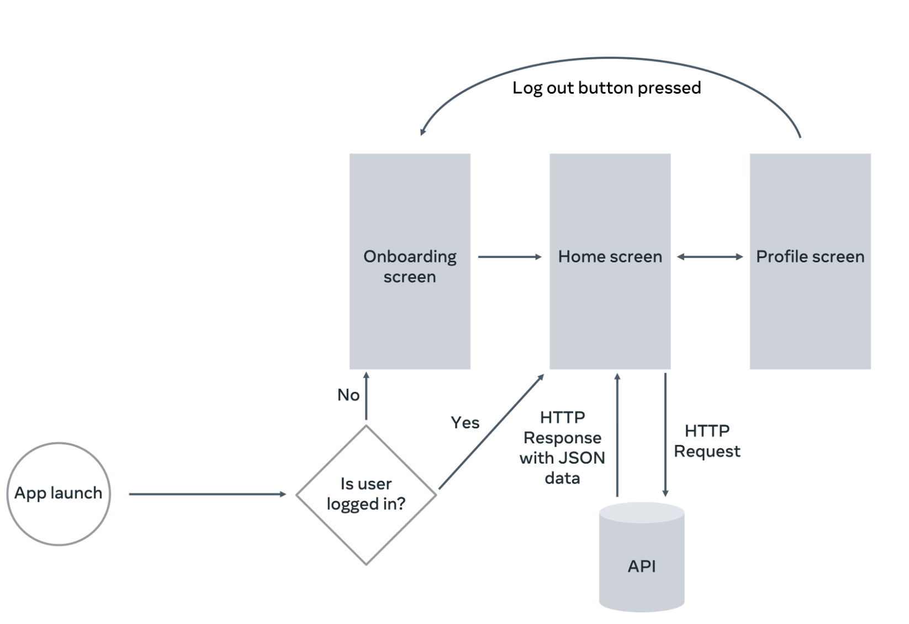

# 🍋 Little Lemon food ordering - Android App

Welcome to **Little Lemon**, a simple, elegant Android app developed as a **Capstone Project** for the **Meta Android Developer Professional Certificate**. This project showcases core concepts of modern Android development, from wireframing and onboarding to navigation and user profiles.

---

## 🧠 Project Overview

**Little Lemon** is a fictional restaurant app designed to provide users with an intuitive experience of browsing, onboarding, and managing their profile. The focus is on usability, clean architecture, and UI/UX best practices.

This app demonstrates proficiency in:
- Jetpack Compose UI components
- Navigation architecture
- Activity and fragment lifecycle management
- Basic local data handling and screen transitions

---

## 📱 Screenshots

### 🏠 Home Screen


### 🚀 Onboarding Screen


### 👤 Profile Screen


---

## 🧭 App Workflow

Here’s a high-level view of the user flow within the app:



---

## 📝 Wireframe (Lo-Fi Design)

Visual planning using low-fidelity wireframes:


---

## 🔧 Features Implemented

- Splash and onboarding flow
- Home screen with minimal UI
- Navigation between major components
- Basic profile management UI
- Static data and resource handling
- Organized folder structure for scalability

---

## 🚀 Getting Started

To build and run the app:

1. Clone the repository:
   ```bash
   git clone https://github.com/23f2001942/Little-Lemon.git
   cd Little-Lemon
